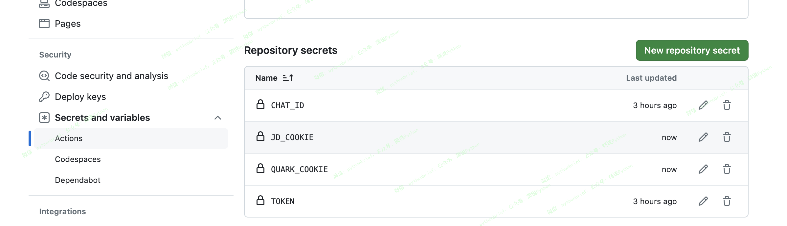

# quark_auto_sign
**本项目基于：** [quark_auto_sign](https://github.com/mushichou/quark_auto_sign)

**目前已添加：** 夸克网盘、京东豆自动签到

## 运行项目

注意，如果只需要自动签到不需要发送签到成功的通知消息，只需要cookie即可,通知目前只支持tg机器人

**使用步骤：**

1. fork本项目

2. 在 Settings -> Secrets and variablesActions -> Actions -> Repository variables 里添加以下环境变量：
- CHAT_ID: tg账号的id
- TOKEN: tg 机器人 TOKEN
- QUARK_COOKIE: 夸克网盘登录 cookies 
- JD_COOKIE: 京东登录 cookies
- DELAY: 随机延时运行，避免总是固定时间签到被封控，**设置成数字**，
- - 1，表示延迟时间随机（30-120分钟），
  - 0，测试运行为了快速看到运行效果可以设置为0。

3. 设置完成后可以点击 Actions -> auto_sign_in -> run workflow

## COOKIE获取方法

浏览器查下，很多说明，查不到也可以加我微信：pythonbrief ，备注：自动签到。

## 赞赏

## 感谢

- [quark_auto_sign](https://github.com/mushichou/quark_auto_sign)
- [Sign](https://github.com/Litre-WU/Sign)